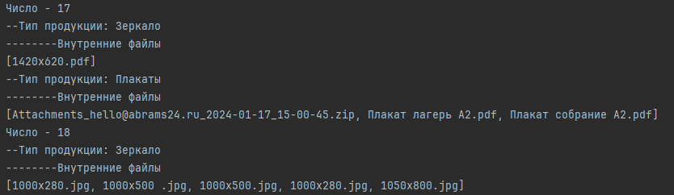
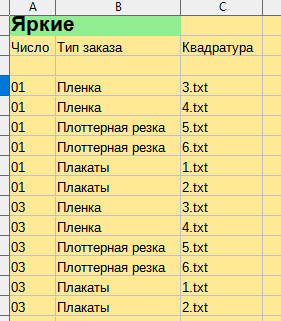
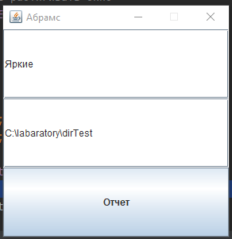
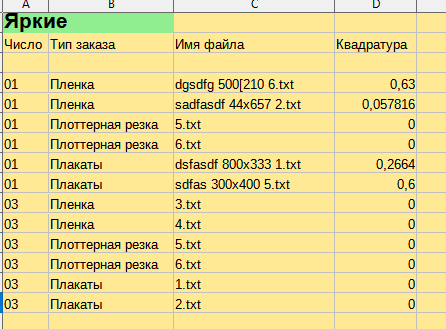

**Задача:**

Разработать UI приложение для формирования excel отчета вида:

  

- Январь 
  - 01  
     - "Рога и копыта"  
         - Перфорированная пленка
             - 297х210 плакат.cdr
             - 1000x600.pdf
         - Плоттерная резка
           - белая пленка 1 комплект.pdf
**Отчет вида:**

Январь "Рога и копыта"  

|число |номер |издели |квадратура|
|-----|-------|-------|----|
|01 | z145 | пленка    | 0.45 кв.м. |  
|01 | z146 | плакат    | 0.22 кв.м. |  
|01 | z147 | плоттерка | 26 кв.м.   |
---
    
**Текущие особенности:**
- Имена файлов порой не имеют четкой структуры. Единообразного именования файлов добиться от всех сложно

**Требования к приложению:**
- Написать название имени клиента ( Рога и копыта )
- Указать папку с месяцем, или любую другую директорию
- Программа должна просканировать все вложенный папки и найти искомые папки с названием клиента
- На основе найденных папках сгенерировать excel отчет

**Боль заказчика:**  
Заполнение одной таблицы затрачивает порой около часа. 
Нужно посмотреть на файл, посчитать размер * кол-во штук, перенести данные вручную в таблицу Excel. 
И так для каждой позиции.
Позиций может быть много и они могут быть разного количества. 
И столько времени уходит только на одного клиента. Отчеты заполняются в первых числах месяца за предыдущий

**Предварительная логика исполнения**

- Так как имена постоянно различаются, это усложняет парсинг из имени файла. 
Поэтому каждый файл должен именоваться по единой схеме. К примеру:    

100x100 святая роща.pdf -> святая роща 100x100 5  
Что при парсинге будет читаться как:    
Имя файла: святая роща  
Размер: 100х100 (делаем split("X") и перемножаем)  
Кол-во: 5  

- Тип для изделия будет браться на основании пакета в котором он лежит.
Если в папке "плакат" значит тип плакат. 
- Следовательно наименование папок нужно соблюдать на стороне клиента. 
Как и именования рабочих файлов, чтобы программа их "видела".

Модуль сканирования
- На основании root собираем все папки с именем клиента List<Path> nameClientPath
- На основании этого nameClientPath группируем файлы на основании числа месяца в TreeMap<String,Map<String<List<String>>>> resultDictionary.  
Где 
  - key - число месяца
  - value - мапа с:
    - key - Тип продукции
    - value - список файлов
- на основании resultDictionary формируем Excel документ
  
Эволюция работы:  
-----
1. raw прототип смысловой группировки

---
2. raw прототип модуля, что формирует Excel таблицу.
Квадратура пока выдает имя файла, позже будем парсить.  

3. raw прототип UI готов + связан с программным модулем. Отчет по нажатию формируется.

4. Регулярные выражение/вычисления квадратуры в деле

Впереди стадии:
- Разработать архитектуру
- Рефактор методов
- Сделать UI человечнее
