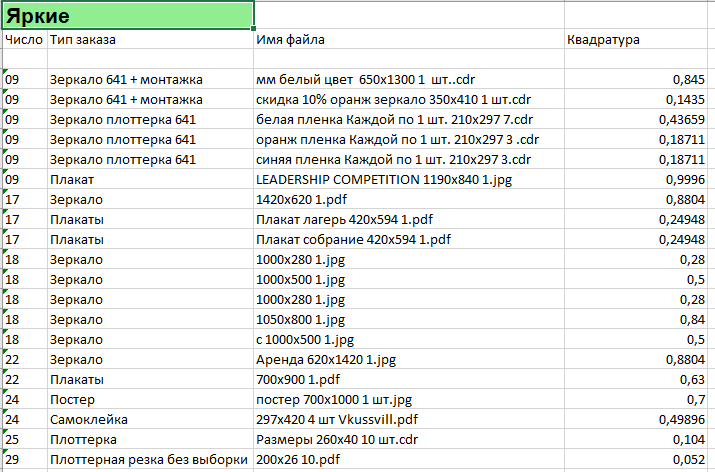
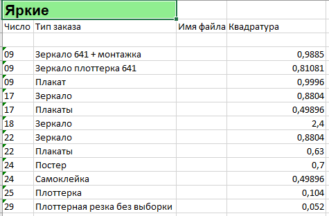

**Задача:**

Разработать UI приложение для формирования excel отчета вида:

- Январь 
  - 01  
     - "Рога и копыта"  
         - Перфорированная пленка
             - 297х210 плакат.cdr
             - 1000x600.pdf
         - Плоттерная резка
           - белая пленка 1 комплект.pdf
**Отчет вида:**

Январь "Рога и копыта"  

|число | тип работы | имя файла            | площадь    |
|-----|------------|----------------------|------------|
|01 | пленка       | test 100x100 1.pdf   | 0.01 кв.м. |  
|01 | плакат       | test 2000x2000 5.cdr | 20 кв.м.   |  
|01 | плоттерка       | test 100x600 10.jpg  | 0.6 кв.м.  |
---
    
**Текущие особенности:**
- Имена файлов порой не имеют четкой структуры. Единообразного именования файлов добиться от всех сложно

**Требования к приложению:**
- Написать название имени клиента ( Рога и копыта )
- Указать папку с месяцем, или любую другую директорию
- Программа должна просканировать все вложенный папки и найти искомые папки с названием клиента
- На основе найденных папках сгенерировать excel отчет

**Боль заказчика:**  
Заполнение одной таблицы затрачивает порой около часа. 
Нужно посмотреть на файл, посчитать размер * кол-во штук, перенести данные вручную в таблицу Excel. 
И так для каждой позиции.
Позиций может быть много и они могут быть разного количества. 
И столько времени уходит только на одного клиента. Отчеты заполняются в первых числах месяца за предыдущий

**Предварительная логика исполнения**

- Так как имена постоянно различаются, это усложняет парсинг из имени файла. 
Поэтому каждый файл должен именоваться по единой схеме. К примеру:    

100x100 святая роща 5шт.pdf **->приводим к виду->** святая роща 100x100 5.pdf  
Что при парсинге будет читаться как:    
Имя файла: святая роща 100x100 5.pdf  
Размер: 100х100 
Кол-во: 5   

**Все размеры в файлы должны быть указаны в миллиметрах!**   
Если кол-во 1шт, и это не указано в файле, то нужно все равно поставить единичку, это важно для парсинга строки.

- Тип для изделия будет браться на основании директории в котором лежит.
Если в папке "плакат" значит тип плакат.
  
Работа приложения
-----  

Три слоя в mvn проекте
- Работа с базой данных(h2 with jdbc api)
- UI модуль на Swing'е
- Back модуль, определяет, что будет писаться в базу, формирование отчета.

Две кнопки:
- "Подробный" (Выводит отчет по каждой позиции отдельно)
- "Сгруппированный" (Группирует по числу и по типу работы)  
  
  

Для запуска приложения. 
- иметь в системе jdk
- Скачать папку RunProgram
- Запустить .bat файл.